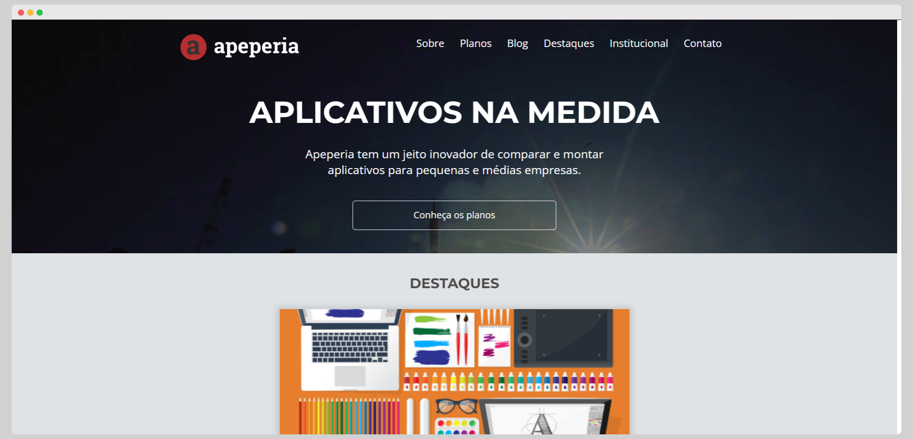
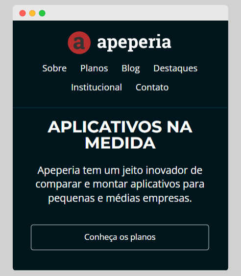
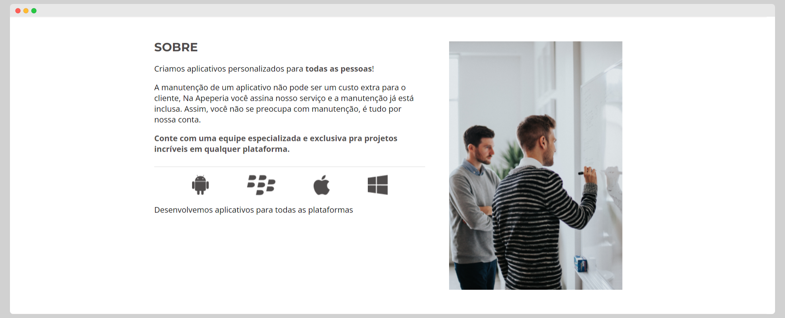
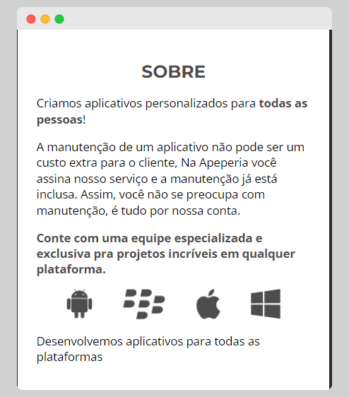

# 📱 Apeperia 

Projeto de estudo desenvolvido durante o curso "Layouts Responsivos: trabalhando com layouts mobile" na plataforma da Alura.

## Funcionalidades

- Design responsivo
- Preview em tempo real
- Multiplataforma

## Aprendizados

- Uso de Unidades Relativas (EM e REM);

- Criação de diferentes estilizações para dispositivos diversos com o uso de media queries;

- Desenvolvimento mobile first;

- Adaptação de estruturas e conteúdos para dispositivos diversos;

## Visualização

[Live Preview](https://nubiasegovia.github.io/apeperia-alura/)

## Screenshots

### Cabeçalho - Desktop

### Cabeçalho - Mobile

### Sessão "Sobre" - Desktop

### Sessão "Sobre" - Mobile

## Tecnologias utilizadas

HTML e CSS

## Autores

- [@nubiasegovia](https://github.com/nubiasegovia)
